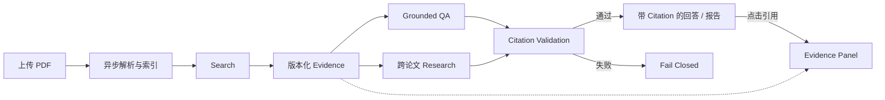
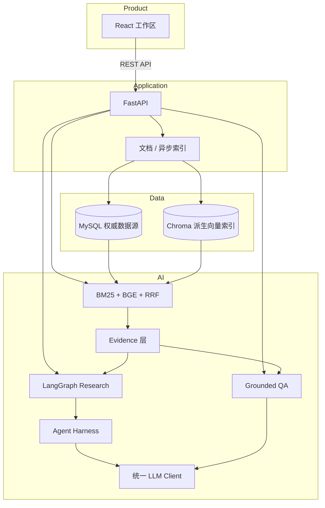
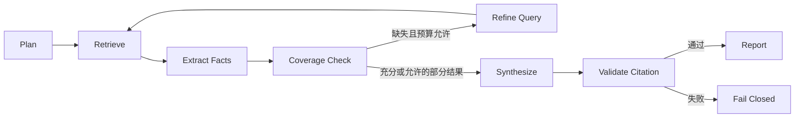

# ResearchGraph

> 面向技术论文的可追溯 AI 研究助手
>
> Evidence-grounded AI Research Assistant

ResearchGraph 是一个面向技术论文的全栈研究助手。上传 PDF 后，你可以建立可版本追踪的论文库，搜索原文 Evidence、提出问题，或比较多篇论文的方法与发现。回答和研究报告中的 Citation 可打开对应证据；引用或证据归属验证失败时，系统会 fail closed，拒绝将未经验证的内容作为可信结果返回。

### 核心能力

- **论文库**：异步导入、持久化索引任务、文档详情与版本。
- **混合检索**：在全部、单篇或多篇论文中寻找相关 Evidence。
- **证据化问答**：从回答中的 `[C1]` 打开 Evidence Panel，核对原文。
- **跨论文 Research**：生成结构化 Comparison，展示覆盖情况、引用和执行记录。

## 30 秒理解 ResearchGraph



## 为什么做这个项目？

研究者需要知道结论来自哪篇论文、哪个版本、哪段原文。仅有引用标记还不够：引用可能不存在，多论文分析可能混淆证据归属，论文重新处理后旧引用也可能失效。

因此，ResearchGraph 将 Evidence 作为一等对象，用不可变版本保留证据身份，用 Citation 验证和 Fact ownership 约束引用关系。生成结果必须经过验证才能成为可信报告；失败会明确呈现，而不是隐藏在一段看似正常的回答中。

## 你可以用它做什么？

**管理与搜索论文。** 在 Library 上传 PDF，查看 Jobs 的索引阶段、失败原因和文档版本。在 Search 限定单篇或多篇论文，打开 Top matching Evidence。检索结果按相关性排序，不保证每条都能回答问题。

**提问与比较。** 在 Ask 输入问题，从 Answer 的 `[C1]` 回到 Evidence Panel。在 Research 选择多篇论文，提出“比较方法、优化目标与主要发现”等问题，查看结构化报告、Comparison 和证据。引用可定位到具体版本与 Chunk，而不只是论文标题。

## 使用流程

1. 在 Library 上传有权处理的论文。
2. 等待 Index Job `succeeded`，确认文档为 `Ready`。
3. 在 Search 检查能否找到相关 Evidence。
4. 在 Ask 提出单次问题，获取带 Citation 的回答。
5. 在 Research 选择多篇论文，执行跨论文分析。
6. 点击 Citation 核对原文、版本和 locator；检查缺失覆盖及失败状态。

<a id="architecture"></a>

## 系统架构



MySQL 保存 Document、DocumentVersion、Chunk、IndexJob 和 Evidence metadata，是权威数据源。Chroma 只服务当前活跃版本，是可重建的向量索引。系统通过最终一致性、权威候选校验和 reconciliation 处理跨存储失败；原始文件单独持久化，历史证据保留在 MySQL。

### 关键设计选择

| 组件 / 决策 | 职责与原因 |
|---|---|
| MySQL 权威、Chroma 派生 | 保留证据身份，同时允许重建搜索索引 |
| 普通 QA 使用直接服务调用 | 避免不必要的 Agent 编排 |
| RRF 融合排名 | 避免直接相加不同尺度的检索分数 |
| LangGraph + Harness | 分开管理工作流状态与受约束执行 |
| 单进程 Index Worker | 复用索引管线，以 MySQL 持久化任务；当前无需分布式队列 |
| Reranker 可选、Graph 条件启用 | 保留实验观察到的收益，同时控制延迟和适用范围 |

## Evidence-first 设计

Evidence 可沿 **Document → Document Version → Chunk → Page / Section → Snippet** 追溯，页码与章节取决于解析结果。稳定 locator 为 `document_id + document_version_id + chunk_id`；`C1` 只是单次回答内的显示标识。

不可变版本使旧引用在论文重新处理后仍可解析。当前 Citation validation 验证结构、引用关系和证据归属，**不等于完整的 semantic entailment verification**：引用存在，并不意味着原文完全支持整句话。

## 混合检索

BM25 擅长词项匹配，Dense Retrieval 捕捉语义相似性，RRF 融合两者排名，避免对不同尺度的 score 直接求和。默认使用 CPU 上的 `BAAI/bge-small-zh-v1.5`，512 维；Reranker 默认关闭。

Search 遵循排名检索契约：即使问题无意义，也可能返回 Top-K 候选。系统没有用未经校准的阈值制造“无结果”。Graph 保留条件检索架构，但默认关闭抽取，真实语料 Graph/Auto 验证尚未完成。

## Grounded QA

Question → Scoped Retrieval → Evidence → LLM → Citation Validation → Answer / Fail Closed。

回答必须绑定 Evidence，只返回实际使用的引用；没有 Evidence 时不调用 LLM，非法 Citation 和模型失败不会被包装成可信回答。普通 Search / QA 不经过 Agent workflow。

## 跨论文 Research

只有 Research 使用 LangGraph，管理计划、状态、覆盖检查和受限补充检索。



这是 bounded workflow：补充检索与执行次数受预算限制，不是无限循环。支持的部分结果会明确标记覆盖不足；违反证据约束的结果不能成为可信报告。

## Agent Harness

LangGraph 决定“下一步做什么”；Harness 约束“如何执行模型和 Tool 调用”。它统一管理 timeout、受限 retry、schema validation、tool allowlist、execution budget 和 trace。执行记录用于解释步骤与故障，不代表模型的私有推理过程。

## 关键正确性设计：跨文档证据归属

单篇论文的 Fact 必须由同一文档、同一版本的 Evidence 支持。ResearchGraph 按文档与版本隔离 Fact extraction 的输入，并通过 `fact_document_mismatch` 校验拒绝跨文档误绑定，确保每项事实的来源边界明确。

跨论文组合只发生在 Synthesis 层。Comparison 的 Citation 由后端从已验证的 Fact supports 确定性绑定，而非由模型自由选择。这项由真实评估驱动的设计使证据归属可核对，但不替代人工语义审核。

## 快速开始

> [!TIP]
> 如果只想体验论文上传、索引和 Search，可以暂不配置 LLM API Key。Ask 和 Research 需要配置 OpenAI-compatible LLM；默认示例使用 DeepSeek。

### 1. 环境要求与克隆

推荐 Git + Docker Desktop（Linux containers）或 Docker Engine + Compose v2。Docker 路径不要求本机单独安装 Python / Node；首次构建和模型下载需要网络。

仓库发布并获得访问权限后：

```sh
git clone https://github.com/tanxunh/researchgraph.git
cd researchgraph
```

### 2. 配置环境

在仓库根目录复制模板，不覆盖已有 `.env`。

Windows PowerShell：

```powershell
if (-not (Test-Path .env)) { Copy-Item .env.example .env }
```

macOS / Linux：

```sh
test -f .env || cp .env.example .env
```

编辑 `.env`：必须替换两个数据库密码占位符。`MYSQL_PASSWORD` 会拼入连接 URL，按模板要求使用 URL-safe 字母数字密码。以下 LLM 配置可先保持 Key 为空：

```dotenv
LLM_API_KEY=
LLM_BASE_URL=https://api.deepseek.com/v1
LLM_MODEL=deepseek-chat
GRAPH_EXTRACTION_ENABLED=false
```

| 变量 | 是否必须 | 默认 / 模板值 | 说明 |
|---|---|---|---|
| `MYSQL_ROOT_PASSWORD` / `MYSQL_PASSWORD` | 必须设置 | 占位符，需替换 | 数据库初始化与应用连接 |
| `MYSQL_USER` / `MYSQL_DATABASE` | 保留即可 | `lifeflow` / `lifeflow_researchgraph` | 当前真实默认名称 |
| `MYSQL_HOST` / `MYSQL_PORT` | 保留即可 | `mysql` / `3306` | 容器内连接地址 |
| `CHROMA_HOST` / `CHROMA_PORT` | 保留即可 | `chroma` / `8000` | 容器内向量服务 |
| `LLM_API_KEY` | Ask / Research 必须 | 空 | Library / Search 不需要 |
| `LLM_BASE_URL` / `LLM_MODEL` | 使用 LLM 时需要 | 上方示例 | OpenAI-compatible 接口，无 `LLM_PROVIDER` 变量 |
| `EMBEDDING_PROVIDER` / `EMBEDDING_MODEL` | 保留即可 | `bge` / `BAAI/bge-small-zh-v1.5` | CPU embedding |
| `GRAPH_EXTRACTION_ENABLED` | 保留即可 | `false` | 基础产品无需 Graph 抽取 |
| `VITE_API_BASE_URL` | Docker 保留 | `/` | nginx 同源代理，构建时生效 |

其余配置见 [.env.example](.env.example)。Ask / Research 会发送必要 Evidence 片段至配置的 LLM，请确认拥有相应数据发送权限。

### 3. 构建、迁移、启动

首次启动在仓库根目录依次执行：

```sh
docker compose config --quiet
docker compose build
docker compose run --rm backend python -m scripts.migrate_all
docker compose up -d
```

迁移命令会启动并等待 MySQL、Chroma 健康，再依次执行证据版本、异步任务和任务创建时间迁移。迁移失败时先处理错误，不要继续启动应用。已有数据库升级前应备份 MySQL 与原始文件并停止写入，详见[部署说明](docs/deployment.md)。

## 验证是否启动成功

```sh
docker compose ps
```

预期 `frontend`、`backend`、`mysql`、`chroma` 均运行，并在初始化完成后显示 healthy。

- 前端：http://127.0.0.1:5173 ，侧栏显示 Backend Online。
- Backend health：http://127.0.0.1:8000/health ，预期 `code=0`、`data.status="ok"`。
- 前端代理健康接口：http://127.0.0.1:5173/health 。
- Swagger：http://127.0.0.1:8000/docs 。

健康检查不代表 BGE 已加载。模型采用 lazy loading，首次索引或检索可能下载权重并额外等待；`/api/system/status` 提供 loaded / ready / error 状态。

## 第一次使用

打开 Library 上传 PDF → 等待 Jobs `succeeded` 和文档 `Ready` → Search 查询并核对 Evidence → 配置 LLM 后使用 Ask → 准备至少两篇 Ready 论文再进入 Research。暂不配置 LLM 时，先完成论文导入与搜索即可。

## 常见问题

1. **Backend Offline**：运行 `docker compose ps` 和 `docker compose logs --tail=100 backend`，检查依赖健康状态、迁移和启动错误。
2. **LLM configuration error**：确认根 `.env` 的 Key、URL、模型名；修改后执行 `docker compose up -d` 更新容器配置。
3. **BGE 首次加载慢**：检查模型下载网络和 backend 日志；缓存会保留，健康接口不会提前加载模型。
4. **MySQL / migration 失败**：查看 `docker compose logs --tail=100 mysql`；已有 volume 的账户密码不会因修改 `.env` 自动改变，勿删除数据来绕过错误。
5. **端口冲突**：调整 `FRONTEND_PORT`、`BACKEND_PORT`、`MYSQL_PUBLISHED_PORT`、`CHROMA_PUBLISHED_PORT`，默认分别为 5173、8000、3307、8001；容器内地址保持不变。
6. **停止与重置**：MySQL、Chroma、原始文件和模型缓存使用 named volumes。`docker compose down` 保留它们；**`docker compose down -v` 会删除本项目持久数据**，不要用于普通排障。更换 Compose 项目名也会选用另一组 volumes。

> [!WARNING]
> `docker compose down -v` 会删除本项目的本地持久化数据。

## 本地开发

需要 Python / Node 的本地开发步骤见 [Backend](backend/README.md) 和 [Frontend](frontend/README.md)；Docker 是推荐复现路径。

<details>
<summary>测试命令</summary>

配置环境后，从根目录运行隔离的后端测试：

```sh
docker compose --profile test run --build --rm --no-deps backend-tests
```

前端测试与构建：

```sh
cd frontend
npm ci
npm test -- --run
npm run build
```

自动化测试使用 Fake Embedding 与 mocked LLM；真实存储测试边界见[测试说明](docs/testing_ci.md)。这些测试不等于真实模型质量评估。

</details>

<a id="evaluation"></a>

## 实验与验证

### Evaluation Snapshot

| 真实论文 | Pages | Chunks | Human-curated queries | Gold Evidence |
|---:|---:|---:|---:|---:|
| 19 PDFs | 274 | 2,298 | 30（英文） | 45 |

覆盖 19/19 篇论文、38 个唯一 Gold Chunk。评估按 Evidence locator 命中计算，多 Gold 使用真正 Recall，不以命中文档代替证据召回。

- **排序收益**：Hybrid Recall@10 为 **48.33%**；加入 Reranker 后为 **54.44%**，MRR@10 为 **0.3637**。
- **延迟代价**：CPU p50 从约 **0.57s → 7.48s**，候选召回不变，因此 Reranker 保留为可选、默认关闭。

真实论文 Evidence retrieval 仍是重要瓶颈。以上仅为小规模固定集合的观察，不代表普遍优势或统计显著提升。

<details>
<summary>查看完整 Retrieval Benchmark</summary>

| Method | Hit@5 | Recall@5 | Recall@10 | MRR@10 | Candidate Recall@20 |
|---|---:|---:|---:|---:|---:|
| BM25 | 36.67% | 31.67% | 38.33% | 0.2977 | 67.78% |
| Dense ZH | 33.33% | 27.78% | 42.78% | 0.2189 | 47.78% |
| Hybrid | 46.67% | 38.33% | 48.33% | 0.3250 | 57.22% |
| Hybrid + Reranker | 50.00% | 44.44% | 54.44% | 0.3637 | 57.22% |

Reranker 从同一 Top-20 候选重排至 Top-10。英文 embedding 实验提高候选覆盖，但部分最终排名指标退化，结论为 NO CLEAR WIN，生产默认不变。本组实验不包含真实语料 Graph/Auto 的测量结果，尚未开展进一步的融合诊断。

</details>

### Research Agent Pilot

10 个任务中，7 个完成、3 个 fail-closed，完成率 **70%**。人工审核覆盖这 7 份可信报告中的 30 个 Claim–Evidence 单元：

| 人工标签 | 数量 | 比例 |
|---|---:|---:|
| Supported | 25 / 30 | 83.33% |
| Partially Supported | 5 / 30 | 16.67% |
| Unsupported | 0 / 30 | 0% |

**该小规模 pilot 中 0% Unsupported，不代表系统幻觉率为 0。** Partial 不合并为 Supported；这些比例不是 Agent accuracy。统计包含 3 个 `fact_document_mismatch` 失败任务；结果对应固定评估版本。

产品已完成真实服务与人工浏览器链路验证；独立仓库验证记录为 254 项 Backend 测试、134 项前端测试通过，离线导入与构建通过。测试记录与模型质量指标分别对应各自的验证范围。公开查询集不含论文正文，复现实验需合法获取语料并建立自己的索引映射，详见[评估说明](docs/evaluation.md)。

## 技术栈

| 层 | 技术 |
|---|---|
| Frontend | React 18 / Vite / Ant Design |
| Backend | Python / FastAPI / SQLAlchemy |
| Workflow | LangGraph / Agent Harness |
| Retrieval | BM25 / BGE / RRF |
| Storage | MySQL / Chroma / 原始文件存储 |
| Infra / LLM | Docker Compose / OpenAI-compatible API（默认 DeepSeek） |

## 项目结构

- `backend/`：API、索引、检索、QA、Research、迁移与测试。
- `frontend/`：产品工作区、共享 Evidence viewer 与前端测试。
- `benchmarks/`：安全的查询定义与 locator，不含论文 PDF。
- `docs/`：系统设计、评估、部署和设计决策。
- `scripts/`：显式运行的产品验证工具。
- `docker-compose.yml`：本地服务与隔离测试配置。

## 当前限制

- Research API 同步执行；索引 worker 为单节点、进程内执行。
- 默认 BGE 偏中文，英文实验结果有取舍；真实论文召回仍有瓶颈。
- Citation 验证不提供完整 semantic entailment 判断。
- Reranker CPU 延迟较高，默认关闭。
- Graph 抽取默认关闭，真实语料验证延期。

## License

[MIT](LICENSE) 覆盖本仓库自身代码。第三方论文、模型及依赖遵循各自许可证；仓库不分发论文 PDF、模型权重或运行数据。
