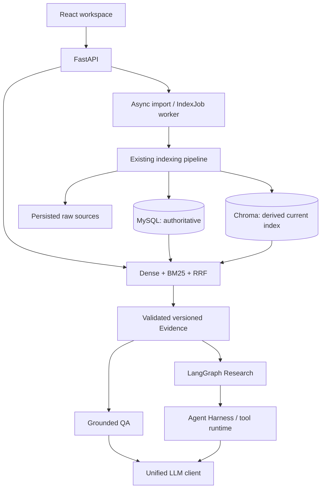
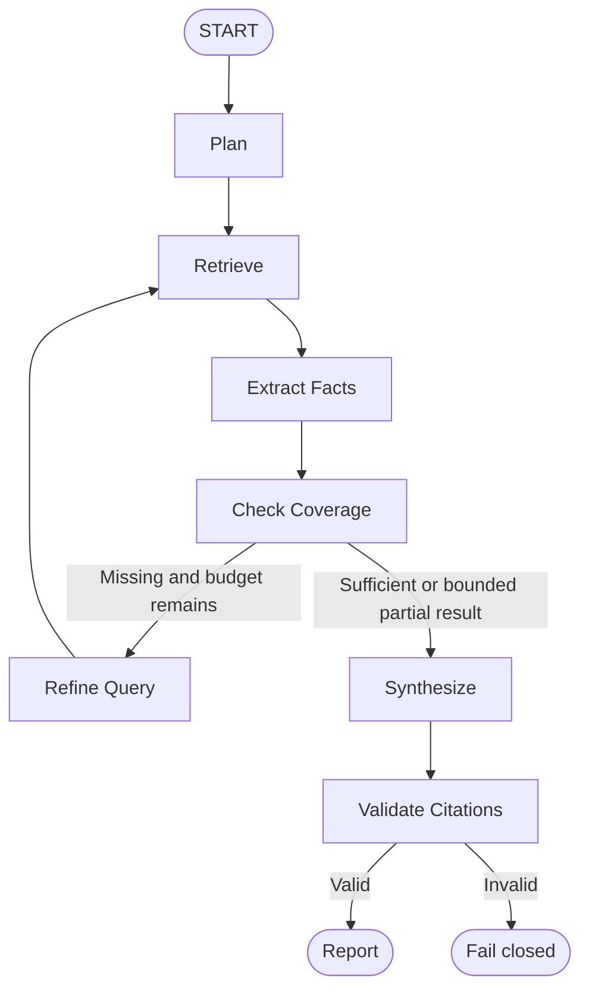

# ResearchGraph

**Evidence-grounded AI Research Assistant** for traceable paper search, grounded QA, and cross-document research.

ResearchGraph indexes technical papers into versioned, traceable evidence. It combines a paper library, scoped hybrid search, citation-grounded answers, and a bounded research workflow in one browser workspace. Evidence is a first-class object: a result can be inspected against the document version and chunk that supported it. Invalid references fail closed instead of becoming a trusted report.

## What it does

- **Paper Library:** upload papers through asynchronous import, follow persistent indexing jobs, and inspect document details and immutable versions.
- **Hybrid Search:** combine BM25 and dense retrieval with RRF across all eligible documents or an explicit document scope. Open ranked evidence directly beside results.
- **Grounded QA:** ask a question against retrieved evidence and follow inline citations to immutable locators. Invalid citations or model failures do not produce a trusted answer.
- **Cross-document Research:** run a bounded workflow that extracts supported facts, checks coverage, and produces a structured comparison with inspectable evidence.

## Why ResearchGraph?

Research work needs more than an answer and a paper title. A reader needs to know which version, page, and passage supports a statement, whether a reference actually exists, and whether a comparison has mixed evidence from different papers. These questions also matter when a document is reprocessed after an answer was generated.

ResearchGraph keeps evidence identity separate from display citations and the current search index. Its design emphasizes provenance, explicit failure states, and measurable retrieval trade-offs. A successful API response alone is not evidence that a model's statement is semantically supported; human review remains a separate activity.

## Architecture



MySQL is the authoritative source for documents, immutable document versions, chunks, evidence metadata, indexing jobs, entities, and relations. Chroma is a rebuildable derived vector index serving current active versions. It is not a second authority. Raw source bytes are persisted separately so reprocessing does not depend on a transient upload.

Index publication uses eventual consistency, authoritative candidate validation, and reconciliation. Retrieval checks candidates against current SQL state rather than assuming every vector hit is valid. Historical evidence remains resolvable from MySQL after a newer version replaces the searchable version. Async indexing uses a persisted job and the existing pipeline, with document locking and explicit failure/recovery semantics.

## Evidence-first design

An evidence locator is `document_id + document_version_id + chunk_id`. Page and section metadata, when available, help readers navigate to the source passage. `C1`, `C2`, and similar labels are local to one answer or report; they are not permanent database identities.

Citation resolution follows document -> immutable version -> chunk -> page/section -> evidence snippet. Reprocessing a paper does not silently redirect an old citation to the newest text. The viewer makes this locator visible so readers can inspect the binding.

Citation validation checks **structural and reference correctness**, including admissible evidence and ownership constraints. It does not establish full semantic entailment. A valid reference can still support only part of a claim; the evaluation below preserves that distinction.

## Retrieval

The production default combines **BM25 + BAAI/bge-small-zh-v1.5 + Reciprocal Rank Fusion**. The embedding has 512 dimensions and runs on CPU. RRF combines ranks because sparse and dense scores occupy different scales, avoiding manual score calibration.

Search supports global, single-document, and multi-document scopes. Ranked candidates may not directly answer a question. A nonsense query can still return Top-K evidence under this rank-based contract; no uncalibrated relevance threshold is used to manufacture an empty result.

`BAAI/bge-reranker-base` is available as an optional post-fusion step and remains **OFF by default**. In the measured pilot it improved final ranking but increased CPU latency substantially. Reranking cannot recover evidence absent from its candidate set.

Graph expansion is conditional and experimental. Synthetic relational/cross-document experiments showed benefits for some cases and possible overall losses. Real-corpus Graph/Auto validation remains deferred, and `GRAPH_EXTRACTION_ENABLED=false` is the default. Graph enrichment is not required for Library, Search, QA, or Research.

## Grounded QA

Question -> scoped retrieval -> Evidence -> answer generation -> citation validation -> answer or fail closed.

Only evidence actually cited in a valid answer is returned as its citations. Empty evidence avoids an LLM call. Model failure is represented as failure, not disguised as answer text. Users can open citations in the shared Evidence viewer and inspect the document, version, chunk, and source passage. Ordinary Search and QA do not use LangGraph or the Agent Harness.

## Cross-document Research



Research needs state, branching, coverage checks, bounded refinement, and multi-step synthesis. LangGraph determines **what happens next**. It does not turn every request into an agent or run an unlimited loop. Exhausting the refinement budget can produce a supported partial result when the contract permits it; invalid evidence cannot be promoted to a trusted report.

### Fail-closed correctness

Evaluation exposed an ownership invariant: a single-document Fact must not use another document's evidence. Extraction now isolates evidence by document and version, while the `fact_document_mismatch` validator enforces that boundary. Cross-document combination belongs in synthesis.

Comparison citations are derived deterministically by the backend from validated Fact supports for the corresponding document and field. The model does not freely select those final comparison references. Supports are deduplicated and mapped to response citation labels. Summary and limitation fields retain their own citation contract. This establishes provenance, not an automatic judgment of semantic truth.

## Agent Harness

LangGraph controls workflow; the Harness controls how permitted operations execute. It supplies timeouts, bounded retries, schema validation, a tool allowlist, execution budgets, and recorded traces. Retrieval/model/tool calls consume explicit budgets, and failures remain inspectable rather than disappearing behind a final response.

Trace records explain execution steps and outcomes for debugging and product inspection. They are not a claim to expose a model's private reasoning. The workflow remains a single bounded research process, with no multi-agent subsystem or distributed scheduler.

## Evaluation

### Retrieval evaluation

The frozen `real-research-pilot-v1` uses **19 real PDFs, 274 pages, 2,298 chunks, 30 human-curated English queries, and 45 gold evidence entries (38 unique chunks)**. Corpus coverage is 19/19 papers. Metrics evaluate gold evidence chunk locators, not merely matching a document title. Multi-gold recall counts the fraction of gold evidence recovered.

| Method | Hit@5 | Recall@5 | Recall@10 | MRR@10 | Candidate Recall@20 |
|---|---:|---:|---:|---:|---:|
| BM25 | 36.67% | 31.67% | 38.33% | 0.2977 | 67.78% |
| Dense ZH | 33.33% | 27.78% | 42.78% | 0.2189 | 47.78% |
| Hybrid | 46.67% | 38.33% | 48.33% | 0.3250 | 57.22% |
| Hybrid + Reranker | 50.00% | 44.44% | 54.44% | 0.3637 | 57.22% |

Hybrid improved Top-K retrieval on this evaluation set. Reranking used the same Top-20 candidate set and kept Top-10; candidate recall was unchanged. Measured CPU p50 increased from about **0.57 s to 7.48 s**, roughly 13x, supporting the decision to keep reranking optional.

An English embedding experiment improved candidate recall to 53.33% for Dense and 65.56% for Hybrid, but Hybrid Recall@5 and MRR regressed. The decision was **NO CLEAR WIN**; the production embedding stayed unchanged. Fusion diagnostics and real Graph/Auto evaluation remain deferred. These small-pilot observations do not establish statistical significance or generalization. See [evaluation scope](docs/evaluation.md).

### Research Agent pilot

The frozen real-agent pilot contains **10 tasks: 7 completed and 3 failed closed**, a **70% task completion rate**. The remaining failures were `fact_document_mismatch` and remain in the results.

Human Claim-Evidence review covered **30 units from the 7 trusted reports**:

| Human label | Units | Rate |
|---|---:|---:|
| Supported | 25 | 83.33% |
| Partially supported | 5 | 16.67% |
| Unsupported | 0 | 0% |

**0% Unsupported in this small pilot does NOT mean hallucination rate is zero.** Partial support is not merged with support, and these percentages are not overall Agent accuracy. Later ownership isolation and deterministic binding changes do not retroactively change these frozen scores.

### Product validation

Backend Vertical Release Gate: **PASS**. Final Browser Product Gate: **PASS**, confirmed through manual product acceptance. The end-to-end chain covered PDF upload -> async indexing -> Search -> Grounded QA -> Research -> evidence resolution, using real services. These product checks establish exercised product paths, separately from the quality pilots above.

## Architecture decisions

| Decision | Reason |
|---|---|
| Simple QA without Agent | Avoid unnecessary workflow orchestration. |
| RRF | Combine ranks without calibrating sparse/dense score scales. |
| MySQL authority / Chroma derived | Preserve evidence authority and rebuild the search index independently. |
| Conditional Graph | Benefits depend on the query and available graph evidence. |
| No multi-agent system | No benchmark evidence justifies the extra complexity. |
| No Redis/Celery queue | Current local scale uses MySQL jobs and an in-process worker. |
| Optional reranker | Observed ranking gains carry substantial CPU latency. |

## Tech Stack

Backend: Python, FastAPI, SQLAlchemy, LangGraph, MySQL, and Chroma. Retrieval: BM25, BGE, and RRF. Frontend: React 18, Vite, and Ant Design. Deployment: Docker Compose with nginx serving the frontend. LLM access uses a unified OpenAI-compatible client, configured here for DeepSeek.

## Quick Start

Install Git, Docker Desktop with Linux containers, and Docker Compose v2.
Once this repository is published (it is not published by this export), clone it:

```sh
git clone https://github.com/tanxunh/researchgraph.git
cd researchgraph
```

Open the repository root. Copy the environment template only when `.env` does not already exist:

Windows PowerShell:

```powershell
if (-not (Test-Path .env)) { Copy-Item .env.example .env }
```

Unix/macOS:

```sh
test -f .env || cp .env.example .env
```

Edit `.env`: replace `MYSQL_ROOT_PASSWORD` and `MYSQL_PASSWORD` placeholders with your own URL-safe passwords. Ask/Research require your own LLM configuration:

```dotenv
LLM_API_KEY=
LLM_BASE_URL=https://api.deepseek.com/v1
LLM_MODEL=deepseek-chat
GRAPH_EXTRACTION_ENABLED=false
```

Library, indexing, and Search do not require an LLM key with Graph extraction disabled. Do not submit private papers to an external LLM without permission to send the required snippets.

Use the verified migration-before-start sequence:

```sh
docker compose config --quiet
docker compose build
docker compose run --rm backend python -m scripts.migrate_all
docker compose up -d
docker compose ps
```

Open http://127.0.0.1:5173; Swagger is at http://127.0.0.1:8000/docs. Frontend nginx proxies `/api` and `/health` to the backend. First use of BGE may download and lazily load model weights; startup health alone does not mean the model is loaded. Models persist in a cache volume and are not committed.

For an existing database, stop writers, preserve credentials and the Compose project name, and back up raw sources with MySQL. Follow [deployment and storage migration instructions](docs/deployment.md) before starting against existing data. Changing the project name selects different volumes. Never use `docker compose down -v` as a routine startup fix: it deletes persisted data.

## Tests

The project includes unit, integration, real MySQL/Chroma, and manual product validation. Automated regression uses Fake Embedding and mocked LLM calls; it does not establish real-model quality.

```sh
docker compose --profile test run --build --rm --no-deps backend-tests
docker compose --profile consistency run --build --rm backend-consistency-tests
cd frontend
npm ci
npm test -- --run
npm run build
```

The frozen frontend baseline is 134 passing tests. Test commands do not authorize a new real-model evaluation. See [testing boundaries](docs/testing_ci.md) for service isolation.

## Project Structure

- `backend/app/`: API, models, indexing, retrieval, generation, research, and runtime services.
- `backend/tests/`: unit and integration regression fixtures and tests.
- `backend/scripts/`: migrations, recovery tools, and explicit evaluation runners.
- `frontend/`: React workspaces, API client, shared Evidence viewer, and tests.
- `scripts/`: controlled product validation tooling.
- `docs/`: architecture decisions, system design, deployment, and evaluation.

## Known Limitations

1. Research requests are currently synchronous.
2. Async indexing uses a single-node, in-process worker rather than a distributed queue.
3. The default Chinese-oriented BGE model showed mixed results on English queries.
4. Citation validation checks structure/references, not full semantic entailment.
5. The optional reranker has a substantial CPU latency cost in the measured environment.
6. Graph retrieval is not enabled by default; real-corpus validation remains deferred.

## License

[MIT](LICENSE) covers this repository's own code. Third-party papers, models, and dependencies remain subject to their respective licenses. Paper PDFs, credentials, runtime databases, vector indexes, uploads, and model weights are not distributed here.

## Using the workspace

After startup, confirm Backend Online. Upload papers you are permitted to process
in Library, then follow Jobs until the documents are Ready. Search a single or
multiple-document scope and inspect Evidence locators. Ask requires an LLM key and
permission to send the necessary snippets. Research compares selected documents
with bounded coverage refinement; inspect its citations and execution summary.
Failed validation does not yield a trusted report.

The published query/locator datasets contain no paper passages. They support
schema and frozen-data regression; reproducing real quality metrics requires your
own legally obtained corpus and ingestion mapping. Real evaluations are opt-in,
not part of startup or CI. Screenshots are optional and deferred.
